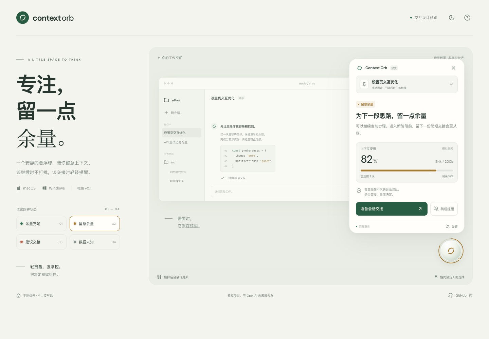

# Context Orb

**专注，让思路清楚。** 面向 Codex 的本地悬浮球，保留有效要求，核对下一步的依据。

> **v0.4.5 · 窗口跟随与平滑停靠。** 球体动态颜色显示有来源的风险线索，容量独立展示，压缩次数可选。桌面支持屏幕和窗口磁吸，并跟随已停靠窗口。真实 token 容量与累计压缩次数尚未接入，明确显示未知；自动语义诊断、换会话收益评估和系统通知尚未实现。



[体验 v0.4 交互预览](http://127.0.0.1:1427)（先按下方命令启动）。上图为 v0.3 的文件检查界面存档。

独立开源项目，与 OpenAI 无隶属关系。目标平台为 Windows 和 macOS，采用 Tauri 应用与可选 Codex 插件。

## 判断什么

| 证据 | 展示 |
| --- | --- |
| 所列有效约束和关键条目的文件检查通过，范围没有待核验项 | 所列检查通过 |
| 任意实际文件检查失败 | 检查未通过，即使还存在未知项 |
| 缺失来源、手动检查、未验证假设或范围不完整 | 证据待补齐 |
| 原要求已被后来的有效要求替代 | 保留来源与作废关系，不进入当前检查 |

检查器支持文字包含、不包含和 SHA-256 比对。文字条件通过不证明代码行为正确；声明的要求也不等于独立采集了原始用户消息。没有“信息熵百分比”，压缩次数和经过时间不产生换会话建议。新开收益始终为“尚未评估”。[判断边界](docs/SEMANTIC-REVIEW.md)。

## 立即体验

需要 Node.js 22.12+，Windows 与 macOS 使用同一组命令：

```sh
git clone https://github.com/Arashi3516/codex-context-orb.git
cd codex-context-orb
npm ci
npm run dev
```

打开[本地预览](http://127.0.0.1:1427)。也可执行 `node scripts/start-preview.mjs` 安装锁定依赖并启动。

浏览器中的会话、文件版本、容量和检查结果均为虚构。可查看来源与账本、模拟修改后重新采集、回顾历史、固定会话、暂缓提醒展示、编辑并复制简报。支持深浅主题、动态配色开关、可选压缩次数、拖动和键盘操作。

## 桌面与插件

安装 [Tauri 前置依赖](https://v2.tauri.app/start/prerequisites/)与 Rust，关闭占用 1427 端口的独立预览，再运行 `npm run desktop:dev`。

启用[仓库插件](plugins/codex-context-orb/README.md)后，在目标 Codex 会话请求 `$context-health`。技能整理声明范围与检查条件，Python 收集器读取明确选定的工作区文件，生成收据并保存；桌面按精确会话 ID 读取。原生窗口默认未绑定，需手动固定。复制检查指令本身不会运行检查。

仓库提供可发现的 marketplace 和 Python / 原生只读诊断入口。安装命令、hook 信任与逐环节核对见[接入说明](docs/DISTRIBUTION.md)。

窗口磁吸设置为「仅限 Codex 窗口｜关闭｜所有窗口」，默认 Codex。拖动后松手必靠边：在允许的窗口内或球体触及可见边框时，完整停靠窗口内侧并随该窗口移动；其余位置或窗口可见区域放不下完整球体时停靠屏幕边缘。关闭窗口吸附时仍停靠屏幕。macOS 使用系统 bundle ID 识别 Codex；Windows Codex 身份尚未验证，该档明确不可用。没有 CLI 或手动窗口绑定。拖动松手后收起详情，点击可再次展开。[交互与平台边界](docs/UIUX.md)。

使用 Rectangle 时，请在它的菜单中为 Context Orb 启用「Ignore」；否则 Rectangle 也会在拖到屏幕边缘时移动悬浮球。Orb 不自动更改其他应用的设置。[Rectangle 官方说明](https://github.com/rxhanson/Rectangle#ignore-an-app)。

Hook 只保存生命周期元数据。收据另存必要的要求摘要、来源路径、文件哈希和检查结果；不保存完整文件内容，但这些摘要仍可能包含私密项目信息。Orb 不读取私有对话文件或凭证，不上传报告，不新增外部 AI 请求。

`npm run desktop:build` 用于开发打包。尚无签名且通过平台验收的安装包；插件源码不代表已安装或官方上架，插件也不能单独提供系统悬浮窗。

## 文档与检查

[判断设计](docs/SEMANTIC-REVIEW.md) · [数据契约](docs/EVIDENCE-CONTRACT.md) · [UI / UX](docs/UIUX.md) · [架构](docs/ARCHITECTURE.md) · [分发](docs/DISTRIBUTION.md) · [路线图](docs/ROADMAP.md) · [验证记录](docs/VERIFICATION.md)

```sh
npm run check
python3 plugins/codex-context-orb/scripts/test_hooks.py
python3 plugins/codex-context-orb/scripts/test_assessments.py
python3 plugins/codex-context-orb/scripts/test_evidence_review.py
python3 plugins/codex-context-orb/scripts/test_doctor.py
cargo test --manifest-path src-tauri/Cargo.toml --locked
npx playwright install chromium
npm run test:ui
```

Windows 使用 `py -3` 代替 `python3`。测试只用虚构数据或临时目录。旧版 v1 主观评估仅供回顾，不再驱动状态。

不自动创建、压缩、中断或关闭会话。代码检查、真实客户端接入、算法准确率、平台分发与插件审核分别验收。[MIT License](LICENSE)。
