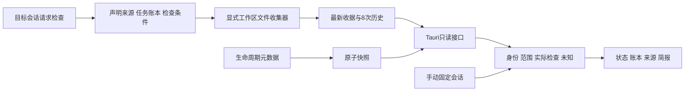

# 架构与证据边界

版本：0.3.0 · 2026-09-06

Tauri 2 提供独立置顶窗口，React/TypeScript 共享网页和桌面界面。Codex 技能声明任务账本与条件；独立 Python 收集器检查本地文件；Rust 验证并只读返回收据。

## 本地数据

| 目录 | 内容与限制 |
| --- | --- |
| events | 小于 4 KiB 的生命周期元数据，无正文或 token 估算 |
| evidence | 每份最多 64 KiB，16 来源、24 条目、32 检查、8 观察；最新与最近八次历史 |
| assessments | v1 兼容回顾，最多 32 KiB；不参与主动判断 |

默认根为 ~/.codex-context-orb；绝对 ORB_DATA_DIR 覆盖须在脚本与桌面保持一致。文件名使用会话 ID 的 SHA-256，但正文并未匿名化。收据保存摘要、路径和哈希，不保存整份文件内容。

收集器只读 manifest 指定的工作区相对文件，限制 1 MiB UTF-8，拒绝越界、链接、私有转录、凭证和环境文件。一次捕获供该来源所有检查共用；不可读或读取中变化时保留 unknown。无网络与额外模型调用。manifest 不能提供结果，由脚本生成。

## 完整性与并发

Python/Rust 验证精确字段、类型、大小、ID、引用、替代图、时间、收据规则和规范 JSON 哈希。哈希证明数据一致性，不证明来源身份或声明为真；本地可写收据并非防篡改的外部证明。

每会话操作系统锁、原子替换与有界 Windows 分享冲突重试用于防止写入交错。旧报告不能覆盖新报告，同时间不同正文被拒绝。先归档旧 latest，再提交新 latest；历史读取合并 latest，处理新收据尚未归档的崩溃窗口。历史保留最近八份；其他目录未实现全局自动保留策略。

原生清单枚举上限 512 项、返回上限 128 份。精确固定会话直接读取，绕开清单上限。命令只接受会话 ID，不接受任意外部路径。完整格式见 [EVIDENCE-CONTRACT.md](EVIDENCE-CONTRACT.md)。

## 绑定与范围

原生默认未绑定且无演示数据兜底。最新活动不能代表前台会话；始终手动固定。v2 报告按会话身份与采集时间验证，不再因 20 分钟或正常 Stop 自动失去历史意义。后续活动显示复查提示，不能证明报告仍描述当前执行。

UI 将来源文字作为文本显示，不执行其内容。不会自动创建、归档、中断或压缩会话。真实 Codex 安装/trust、身份传递和原生显示的完整链，以及跨平台运行时验收仍需独立完成。
