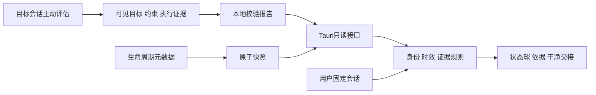

# 架构与证据边界

版本：0.2.0 · 2026-09-06

Tauri 2 提供独立置顶窗口，React/TypeScript 提供桌面和网页共用界面，可选 Codex 插件提供生命周期元数据与用户发起的语义评估。

## 两种本地数据

| 通路 | 内容与限制 |
| --- | --- |
| events | 会话/轮次、事件名、收到时间、模型与触发类型；小于 4 KiB，无正文、路径和 token 估算 |
| assessments | 最小目标、下一步、问题摘要、证据位置与覆盖程度；最多 32 KiB、8 信号，每项 1–4 来源 |

默认根 `~/.codex-context-orb`，可用绝对路径 `ORB_DATA_DIR` 覆盖；桌面与脚本须一致。文件名为 SHA-256(session_id)，这并不使正文匿名。

Hook 原子替换；Windows 短暂替换冲突最多 5 次、累计等待 150ms，失败不干预会话。评估另有每会话操作系统锁与旧报告防覆盖，同时间不同正文明确拒绝。

Python/Rust 拒绝超限、错误类型、未知字段和重复 JSON 字段。reader 不接受任意外部文件路径。清单最多枚举 512 项并返回 128 份快照；固定会话按精确 ID 读取，绕开清单上限。自动保留/清理尚未实现。

## 绑定与失效

原生默认未绑定，没有 demo 兜底。最新活动不代表前台选中；手动固定必须明确标识。判断只消费同会话报告，不使用容量数据。

报告超过 20 分钟、轮次不匹配或存在更晚 hook 时等待复查。最后一条异步快照无法证明没有遗漏或乱序事件，因此结果仅反映本次评估，不能保证实时质量。

自动前台跟随需要验证多窗口、后台/远程任务、最小化与切换。新的 app-server 连接不自动代表已有 Desktop 的选中状态。[官方 app-server 文档](https://learn.chatgpt.com/docs/app-server)

## 权限与真实性

Hook 不采集正文，只输出空 JSON。手动 skill 使用 Codex 当时可见上下文；另存摘要可能包含私密项目内容。Orb 不读取原始 transcript、账号或凭证，不上传报告、不新增外部 AI 调用。评估运行于用户已有 Codex 会话。

Schema 只证明结构合法，不能证明内容为真。界面仅显示文本，不执行报告里的引用或指令。准确性需要可追溯核对和真实案例评估。

不自动创建、中断、压缩或关闭会话。交接由用户核实；未知或过期评估不当作有效事实预填。详见 [语义评估](SEMANTIC-REVIEW.md)。
