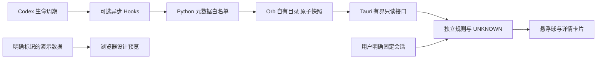

# 架构与证据边界

版本：0.1.0 · 状态：可运行的框架与交互设计预览 · 2026-09-06

Context Orb 采用独立桌面悬浮球和可选 Codex 插件。首期交付窗口、界面、规则和有限元数据接入的基础；自动绑定当前前台会话、真实上下文占用采集和语义杂乱判断尚未验收。网页演示数据必须与原生界面的本地观察分开标识。

公开仓库目标：[Arashi3516/codex-context-orb](https://github.com/Arashi3516/codex-context-orb)。远端发布和安装包状态以 [分发文档](DISTRIBUTION.md) 及实际发布记录为准。

## 决策：独立窗口与可替换适配器

桌面壳使用 Tauri 2，界面使用 React、TypeScript 与 Vite。Windows x64、macOS Apple Silicon 和 Intel 是目标平台。窗口、数据采集、规则计算和展示各自有明确边界；单个平台的实现通过不能代表其他平台已验收。

官方 Pets 支持自定义外观以及固定的活动状态，当前公开文档没有提供自定义健康状态、任意事件输入或动作扩展协议。因此本项目使用自己的悬浮球与视觉素材。未来若官方开放稳定接口，可以新增适配器。这个选择不要求修改 Codex 应用文件或向渲染页面注入代码。[Pets 文档](https://learn.chatgpt.com/docs/pets)



## 当前实现与后续能力

| 能力 | 0.1.0 边界 | 后续验收要求 |
| --- | --- | --- |
| 悬浮球、详情卡片与交互预览 | 交互设计与桌面壳基础 | 两个平台真实运行、窗口和键盘验收 |
| 生命周期输入 | 插件 Python 适配器可独立运行并测试 | 官方客户端安装、trust 与异步分发实测 |
| 原生会话选择 | 保持未绑定，或由用户手动固定并明确标识 | 有可靠的前台窗口与精确会话标识来源 |
| 上下文占用 | Hook 快照两个 token 字段均为 `null` | 来自对应会话及模型窗口的可追溯测量 |
| 语义杂乱 | 未实现；演示不能成为真实评分 | 有标注案例、可解释理由和误报评估 |
| 新会话交接 | 桌面提供用户填写、审阅与复制的模板；Skill 可按请求依据已有会话上下文起草摘要 | 验证摘要内容及用户主动开启新会话的完整流程 |

## Hook snapshot v1

插件文件位于 `plugins/codex-context-orb`，规范在 [hook-event.schema.json](../plugins/codex-context-orb/scripts/hook-event.schema.json)。桌面界面只消费投影后的快照，不接收用户 prompt、工具参数、工具输出或助手正文。

默认路径为 `~/.codex-context-orb/events/<sha256(session_id)>.json`。`ORB_DATA_DIR` 可覆盖数据根，必须是绝对路径，桌面与 hook 进程必须一致。文件名是 session id 的 SHA-256，不包含标题或项目路径；文件内仍包含有限的会话标识，它们属于本地用户数据。

```json
{
  "schema_version": 1,
  "source": "codex-hook",
  "session_id": "thr-example",
  "turn_id": "turn-example",
  "observed_at_ms": 1788652800000,
  "last_event_name": "PostCompact",
  "model": null,
  "trigger": "auto",
  "context_used_tokens": null,
  "context_window_tokens": null,
  "binding": "unbound"
}
```

`observed_at_ms` 是适配器开始处理输入的本地时间，不是服务器事件序号。多个异步 hook 可以乱序完成，因此 `last_event_name` 只表示最近写入的观察，不能据此宣称当前仍在工作、已经停止或前台正在显示该会话。首期不推导累计压缩次数。

适配器只注册 `SessionStart`、`UserPromptSubmit`、`PreCompact`、`PostCompact`、`Stop` 和 `Interrupt`。每个 handler 异步运行、超时两秒，只返回空 JSON；不返回 `systemMessage`、`additionalContext`、`continue` 或审批决定。用户需通过 Codex 自己的 hook trust 流程。快照写入失败不会请求模型重试，不会更改会话。[Hooks 文档](https://learn.chatgpt.com/docs/hooks)

每次输入最多 64 KiB，输出快照小于 4 KiB，使用同目录临时文件加原子替换。首期每会话保留一份快照，不保存事件历史；跨会话自动清理策略未实现。Python inspector 最多枚举 512 个目录项、读取 128 个快照并报告覆盖不完整。桌面 reader 最多检查 512 个目录项并返回 128 个快照，校验文件大小、文件名与会话 ID 的哈希匹配、白名单字段和 schema 版本；界面将超过五分钟或异常未来时间的数据判为未知。桌面尚未展示目录覆盖不完整的状态，保留上限与该状态的端到端提示列入下一阶段。

## 前台绑定是独立验收门槛

`session_id` 或 `thread_id` 识别一段会话，无法证明用户正在看它。`latest`、文件修改时间、最近 token 事件、活跃子代理和运行进程均不足以证明前台选择。

App-server 为自建客户端提供线程和 token 事件。新启动一个进程，或读到其 `thread/loaded/list`，都不等于订阅到了既有 Desktop 窗口的选中状态。本项目不会以 `thread/resume`、新请求或改写历史的方式探测这一点。[App-server 文档](https://learn.chatgpt.com/docs/app-server)

后续必须以实际支持的平台、Codex 版本和窗口切换测试证明绑定。至少覆盖：A 在前台而 B 持续输出；同项目多个会话；两个 Codex 窗口；最小化、失焦、重开；远程任务和子代理。找不到可靠信号时，保留手动固定或未知，并停用以“当前会话”为前提的自动提醒。

## 指标与提示规则

容量规则只能消费同一会话当前上下文用量与匹配的窗口容量。账户五小时/每周额度、历史累计收费 token、缓存量、JSONL 大小和文本字符数均不得替代。首期 hook 没有容量字段来源，即使输入混入同名数字，也会丢弃并写成 `null`。

“容量接近上限”和“任务内容混杂”是不同判断。未来语义提示应列出观察理由，如目标多次切换或未关闭的冲突决策，并接受忽略与纠正。只有长度时不能声称理解了语义杂乱，也不能给出没有验证依据的精确健康分。

首期浏览器演示用 75% 和 90% 固定阈值展示容量状态；“稍后提醒”展示十分钟静音交互，系统通知尚未接入。后续提醒需实现并验证阈值跨越、冷却和压缩后重置等规则；具体数值是产品策略，不是模型质量的通用保证。没有可靠会话绑定或测量时，不自动触发容量健康判断。桌面交接按钮只生成待填写模板并在用户操作时复制；创建、压缩、关闭或中断会话均不自动执行。

## 数据与发布边界

首期 hook 与桌面采集路径均在本机，不读取 Codex 登录文件，不上传会话正文。开发服务器仅用于本机预览。未来若引入语义分析或远程服务，需另行定义明确的数据范围、启用方式与文档，不能沿用“只有元数据”的旧声明。

源码测试、桌面编译、签名安装包、实际客户端适配和官方插件目录审核分别验收。任何一个通过都不能替代其他结果。分发细节见 [DISTRIBUTION.md](DISTRIBUTION.md)，验收顺序见 [ROADMAP.md](ROADMAP.md)。
